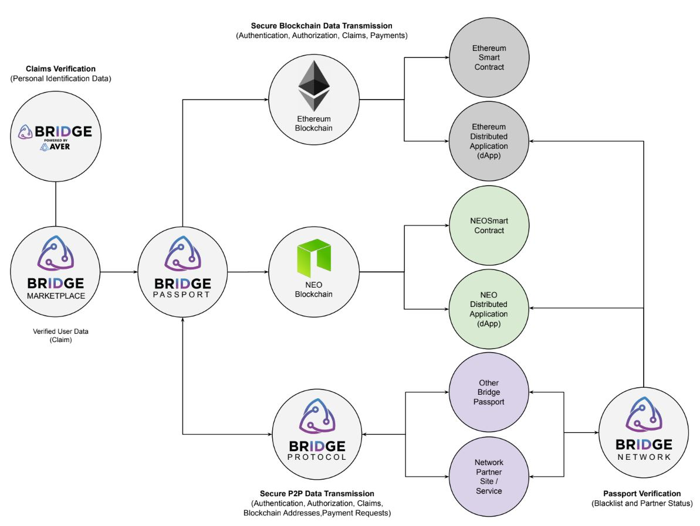

  

<h3 align="center">Bridge Protocol and Bridge Protocol Network SDK</h3>

# Summary

The Bridge Protocol SDK encompasses all functionality of the Bridge Passport, Bridge Protocol, Bridge Network API, BRDG Token, NEO Blockchain Smart Contract(s), and Ethereum Blockchain Smart Contract(s).

